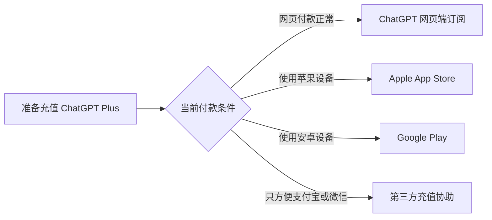
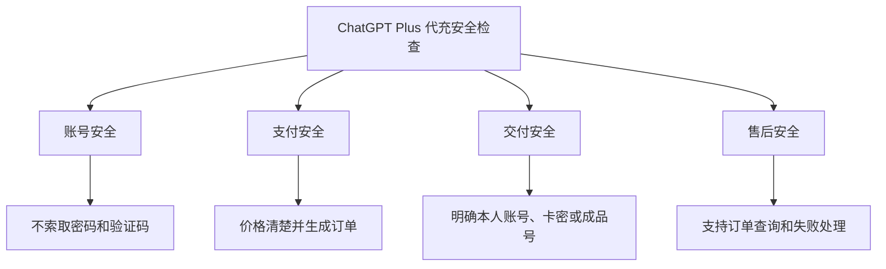
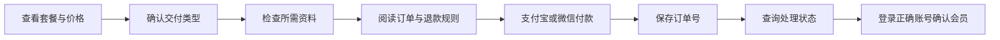

# ChatGPT Plus 代充安全吗？本人账号、卡密与成品号避坑指南

> 最后更新时间：2026 年 8 月 4 日  
> 适用对象：准备使用支付宝、微信充值 ChatGPT Plus，并正在比较本人账号、卡密与成品账号的用户。

国内用户准备充值 ChatGPT Plus 时，常见顾虑包括：

- ChatGPT Plus 代充安全吗？
- 是否需要提供账号密码？
- 会员会充值到自己的账号吗？
- 卡密和成品账号有什么区别？
- 付款后能否查询订单？
- 充值失败能否退款？
- 怎样判断第三方充值平台是否可靠？

先说结论：

> 第三方代充不是 OpenAI 官方订阅渠道。是否值得选择，不能只看价格，而要同时检查账号安全、交付类型、订单查询和退款规则。

---

## 一、ChatGPT Plus 代充是什么？

ChatGPT Plus 代充通常是指：

用户通过独立第三方充值协助平台完成付款，再由平台按照商品说明交付对应会员服务。

它与用户直接在 ChatGPT 网页端、Apple App Store 或 Google Play 订阅并不是同一个购买渠道。

常见路径如下：



有合适官方付款条件的用户，可以优先查看 ChatGPT 当前结算页面。

需要支付宝或微信付款的用户，可以了解第三方充值，但下单前必须看清商品与售后规则。

---

## 二、本人账号、卡密和成品账号有什么区别？

| 交付方式 | 实际含义 | 更适合谁 | 购买前重点 |
|---|---|---|---|
| 本人账号充值 | 会员开通到用户原来的账号 | 需要保留聊天记录的用户 | 账号匹配、资料安全、到账确认 |
| 卡密或自助兑换 | 获得兑换信息后自行操作 | 希望自助完成的用户 | 兑换入口、有效期、失败处理 |
| 成品账号 | 获得一个已开通会员的新账号 | 可以接受更换账号的用户 | 是否独享、邮箱权限、质保规则 |
| 共享账号 | 多人使用同一个会员账号 | 不建议用于重要工作 | 隐私、登录冲突、账号稳定性 |

### 本人账号充值

本人账号充值更适合：

- 需要保留历史聊天记录；
- 已经长期使用同一个账号；
- 不希望更换登录方式；
- 账号中有项目、文件或自定义设置；
- 准备长期使用 ChatGPT Plus。

付款前必须确认：

- 会员最终开通到哪个账号；
- 填错账号后能否修改；
- 是否需要提交密码或验证码；
- 到账后怎样确认会员状态。

### 卡密或自助兑换

“卡密”通常是第三方平台对兑换信息或自助充值信息的统称。

不能仅凭“卡密”两个字，就认定它是 OpenAI 官方兑换码。

购买前要确认：

- 卡密在哪里使用；
- 对应哪个套餐；
- 是否只能使用一次；
- 是否存在有效期；
- 是否限制账号或地区；
- 兑换失败如何处理；
- 填错账号能否修改。

### 成品账号

成品账号不是给用户原有账号充值，而是交付一个新的会员账号。

购买前必须确认：

- 是否真正独享；
- 邮箱控制权归谁；
- 能否修改密码；
- 能否设置安全验证；
- 是否允许多人登录；
- 账号异常后的售后范围。

---

## 三、代充安全要检查哪四层？



### 1. 账号安全

不要随意向第三方提供：

```text
ChatGPT 登录密码
邮箱密码
短信验证码
邮箱验证码
Cookie
Session Token
双重验证恢复代码
API Key
支付密码
```

Cookie 和 Session Token 可能被用于访问账号，风险并不低于直接提供密码。

### 2. 支付安全

付款前应看清：

- 商品名称；
- 实际价格；
- 使用周期；
- 交付方式；
- 是否自动续费；
- 订单查询入口；
- 退款规则。

付款后至少应该获得：

- 订单号；
- 商品名称；
- 支付金额；
- 当前状态；
- 查询方式；
- 售后入口。

### 3. 交付安全

商品页面应明确写出：

```text
本人账号充值
卡密或自助兑换
成品独享账号
共享账号
其他交付方式
```

只写“ChatGPT Plus”，却不说明会员开通到哪里，不建议直接付款。

### 4. 售后安全

付款前应确认：

- 未到账如何查询；
- 账号填错如何处理；
- 卡密不能使用怎么办；
- 什么情况属于充值失败；
- 充值失败是否退款；
- 售后由哪个平台负责。

---

## 四、出现这些情况不要继续付款

### 风险一：要求发送敏感资料

出现以下要求应立即停止：

```text
发送邮箱验证码
复制浏览器 Cookie
提交 Session Token
提供邮箱密码
提供 API Key
提供支付密码
```

### 风险二：付款后没有正式订单

如果付款后只有聊天记录或私人收款凭证，却没有订单号和查询入口，发生问题后很难核查。

### 风险三：冒充 OpenAI 官方

没有正式授权证明的第三方平台，不应使用：

```text
OpenAI 官方代充
OpenAI 官方授权
官方合作渠道
百分百不会封号
永久稳定
绝对安全
```

第三方平台可以介绍充值服务，但必须准确披露独立第三方身份。

### 风险四：付款后不断要求补款

付款后又以以下理由要求继续转账，应立即暂停：

- 风控费；
- 验证费；
- 解锁费；
- 激活费；
- 特殊通道费。

必要费用应该在下单前写清楚。

### 风险五：低价但不说明交付方式

同样写着 ChatGPT Plus，实际可能是：

- 本人账号充值；
- 卡密兑换；
- 成品独享账号；
- 多人共享账号；
- 短期账号。

价格必须和交付方式、使用周期及售后规则一起比较。

---

## 五、ChatGPT Plus 代充的正确流程



具体步骤：

1. 打开 ChatGPT 产品页面；
2. 查看当前套餐、价格和周期；
3. 确认本人账号、卡密或成品账号；
4. 检查是否索取敏感资料；
5. 阅读订单查询和退款说明；
6. 使用支付宝或微信付款；
7. 保存订单号和查询信息；
8. 查询订单处理状态；
9. 完成后登录正确账号；
10. 在账号设置中确认当前套餐。

---

## 六、付款后没有到账怎么办？

付款后暂时没有显示会员，不要马上重新购买。

正确顺序：

```text
保存支付凭证
→ 查询原订单
→ 确认交付类型
→ 确认登录账号
→ 退出并重新登录
→ 检查当前套餐
→ 联系原购买平台
```

用户可能同时使用：

- Google 登录；
- Apple 登录；
- Microsoft 登录；
- 邮箱登录；
- 多个不同邮箱。

购买时和检查时进入不同账号，可能误以为会员没有到账。

原订单仍处于处理中时，再次付款可能产生重复订单。

---

## 七、通过 MuyuGPT 充值 ChatGPT

MuyuGPT 是独立第三方 AI 会员充值协助平台，与 OpenAI 不存在官方隶属、授权或合作关系。

MuyuGPT 当前 ChatGPT 产品页面提供：

- ChatGPT 相关商品；
- 人民币价格；
- 支付宝和微信付款；
- 本人账号、卡密及其他交付说明；
- 无需提交账号密码的充值流程；
- 订单号和查询信息；
- 订单状态查询；
- 充值失败处理说明。

查看当前套餐、价格和充值说明：

[MuyuGPT ChatGPT 会员充值页面](https://muyugpt.com/chatgpt)

操作顺序：

```text
查看当前商品
→ 确认套餐
→ 确认交付方式
→ 使用支付宝或微信付款
→ 保存订单号
→ 查询处理状态
→ 登录 ChatGPT 确认会员
```

具体商品、价格、处理时间、交付方式和退款条件，应以下单时页面及订单状态为准。

---

## 八、购买前检查清单

- [ ] 已确认购买的是 ChatGPT Plus；
- [ ] 已确认本人账号、卡密还是成品账号；
- [ ] 已确认会员最终开通到哪个账号；
- [ ] 页面没有索取密码、验证码或登录令牌；
- [ ] 已确认价格和使用周期；
- [ ] 已确认是否自动续费；
- [ ] 付款后能够获得订单号；
- [ ] 已找到订单查询入口；
- [ ] 已阅读充值失败和退款规则；
- [ ] 平台没有冒充 OpenAI 官方身份。

任何一项不清楚，都应在付款前确认。

---

## 九、常见问题

### ChatGPT Plus 代充一定安全吗？

不存在可以无条件承诺“绝对安全”的第三方服务。

用户应检查交付方式、敏感资料、订单查询、账号控制权和退款规则。

### 本人账号充值会保留聊天记录吗？

会员开通到原账号后，用户仍然使用原来的账号和聊天记录。

关键是确保购买和检查时登录的是同一个账号。

### 代充需要提供密码吗？

不应默认提交账号密码、邮箱验证码、Cookie 或 Session Token。

### 卡密一定是官方兑换码吗？

不一定。

应检查兑换入口、适用套餐、使用期限和失败处理规则。

### 付款后没有到账可以重新下单吗？

不建议。

应先查询原订单并确认登录账号，避免产生重复订单。

### 充值失败可以退款吗？

退款应以购买平台商品页面、服务条款和订单核查结果为准。

---

## 十、总结

判断 ChatGPT Plus 代充是否值得选择，不能只看价格。

真正需要检查的是：

```text
交付方式是否清楚
是否索取敏感资料
是否生成正式订单
是否能够查询状态
是否公开失败和退款规则
是否准确披露第三方身份
```

需要保留历史聊天和原有项目，应该优先了解本人账号充值。

选择卡密时，要确认兑换入口、适用套餐和失败处理。

选择成品账号时，要重点检查邮箱控制权、密码修改、安全验证和质保范围。

---

## 相关阅读

- [ChatGPT 充值多少钱？价格与套餐选择指南](chatgpt-recharge-price-guide.md)
- [ChatGPT 充值多久到账？订单与退款处理指南](chatgpt-recharge-arrival-time.md)
- [ChatGPT Plus 支付失败怎么办？](chatgpt-plus-payment-failed.md)
- [ChatGPT Plus 怎么用支付宝微信充值？](chatgpt-plus-pro-alipay-wechat-recharge.md)

---

## 资料来源

- OpenAI ChatGPT 帮助中心  
  https://help.openai.com/

- OpenAI ChatGPT 订阅与账单说明  
  https://help.openai.com/en/collections/3742473-chatgpt

- MuyuGPT ChatGPT 充值页面  
  https://muyugpt.com/chatgpt

> 说明：本文由 MuyuGPT 整理。MuyuGPT 是独立第三方 AI 会员充值协助平台，不代表 OpenAI 官方渠道。
