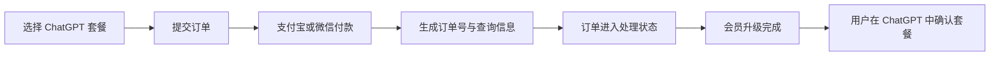
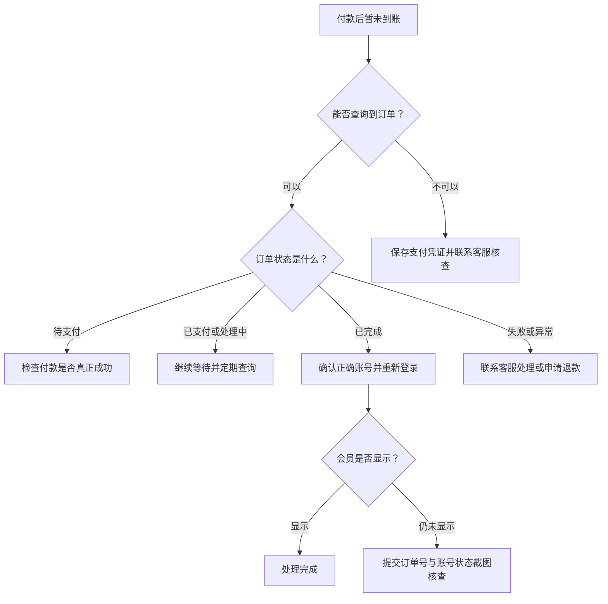

# ChatGPT 充值多久到账？订单查询、未到账与退款处理指南

> 最后更新时间：2026 年 8 月 3 日  
> 适用对象：已经购买 ChatGPT Go、Plus 或 Pro，但正在等待到账，或者遇到订单处理中、会员未显示、重复付款和退款问题的用户。

很多用户付款后最关心的问题是：

- ChatGPT 充值多久能到账？
- 已经付款，为什么会员还没有显示？
- 怎样查询充值订单？
- 订单一直“处理中”怎么办？
- 银行或支付宝已经扣款，但订单不存在怎么办？
- 长时间没有到账能否退款？
- 应该重新付款，还是继续等待？

遇到这些情况时，最重要的一条原则是：

> **先查询原订单，不要立即重复付款。**

重复付款可能产生多个订单，反而让后续查询和退款变得更复杂。

---

## 先说结论

ChatGPT 充值的到账时间，不是由一个固定数字决定。

它可能受到以下因素影响：

- 支付是否真正成功；
- 订单是否成功生成；
- 用户提交的资料是否准确；
- 当前订单处理数量；
- ChatGPT 官方服务状态；
- 账号登录方式是否正确；
- 页面或客户端是否及时刷新；
- 订单是否需要人工核查；
- 支付通道是否出现延迟。

正常订单通常可以较快处理，但具体到账时间应以订单页面和账号实际状态为准。

如果已经付款但暂时未到账，建议按照下面的顺序处理：

1. 保存支付凭证；
2. 查询原订单状态；
3. 确认登录的是正确的 ChatGPT 账号；
4. 退出 ChatGPT 后重新登录；
5. 检查账号中的订阅状态；
6. 不要重复付款；
7. 长时间未处理时联系客服核查；
8. 确认无法完成充值后，按照退款政策处理。

---

## 一、ChatGPT 充值通常要经历哪些步骤？

一次完整的充值订单，通常会经过下面几个环节：



从付款到会员显示，并不是只有“付款成功”这一步。

付款完成以后，系统还需要确认：

- 支付结果；
- 订单信息；
- 对应套餐；
- 用户账号；
- 实际交付结果；
- ChatGPT 账号中的会员状态。

因此，“已经扣款”和“已经到账”是两个不同的状态。

---

## 二、不同订单状态分别代表什么？

查询订单时，可能看到不同状态。

### 1. 待支付

表示订单已经创建，但支付系统尚未确认付款成功。

可能原因：

- 用户还没有完成付款；
- 支付页面中途关闭；
- 支付结果正在同步；
- 用户选择了“稍后支付”；
- 支付通道返回结果较慢。

此时先不要重新创建订单。

可以打开订单查询页面，确认原订单是否仍可继续付款。

---

### 2. 已支付

表示支付结果已经确认，但会员服务可能还没有完成交付。

这个阶段通常需要继续等待订单处理。

建议：

- 保存订单号；
- 不要重新付款；
- 不要修改账号信息；
- 定期查询订单状态；
- 留意订单页面的提示。

---

### 3. 处理中

表示订单已经进入实际处理流程。

处理中不等于失败。

可能正在进行：

- 核对订单信息；
- 匹配对应套餐；
- 执行会员升级；
- 等待 ChatGPT 官方状态同步；
- 人工核查异常订单。

如果订单处于处理中，应优先等待，而不是重复下单。

---

### 4. 已完成

表示系统已经完成订单交付。

此时用户应登录正确的 ChatGPT 账号，检查会员状态。

如果订单显示完成，但账号中仍然显示免费版，应继续排查：

- 是否登录错账号；
- 是否使用了不同登录方式；
- 页面是否没有刷新；
- App 是否缓存旧状态；
- 会员状态是否仍在同步。

---

### 5. 失败或异常

表示订单没有正常完成，需要进一步核查。

不要直接删除订单或再次付款。

应准备：

- 订单号；
- 下单邮箱或手机号；
- 支付时间；
- 支付金额；
- 支付凭证；
- ChatGPT 当前会员状态截图；
- 错误提示截图。

然后联系客服核查原因。

---

## 三、怎样查询 MuyuGPT 充值订单？

MuyuGPT 每笔订单都会生成订单信息，用户可以在订单查询页面查看支付和发货进度。

订单查询页面：

[MuyuGPT 订单查询](https://muyugpt.com/order)

可以使用以下任一信息查询：

- 订单号；
- 下单邮箱；
- 下单手机号。

查询后可以查看：

- 是否已经支付；
- 当前处理状态；
- 是否已经完成；
- 是否需要补充信息；
- 是否存在异常。

查询结果中的联系方式会进行脱敏处理。

如果涉及修改订单或其他敏感操作，需要联系客服进一步核验。

---

## 四、付款后一定要保存哪些信息？

建议付款完成后立即保存以下资料：

| 信息 | 用途 |
|---|---|
| 订单号 | 查询订单和联系客服时使用 |
| 查询密码 | 查看订单进度 |
| 下单邮箱或手机号 | 找回和查询订单 |
| 支付时间 | 核对支付记录 |
| 支付金额 | 判断订单是否匹配 |
| 支付凭证 | 处理异常或退款时使用 |
| 套餐名称 | 确认购买的是 Go、Plus 还是 Pro |
| ChatGPT 登录账号 | 确认会员升级到正确账号 |

不要只保留一张支付成功截图，却把订单号关闭或删除。

订单号通常比聊天记录更重要。

---

## 五、已经付款，但查不到订单怎么办？

这种情况需要先判断付款是否真正完成。

### 第一步：检查支付软件

打开支付宝或微信，确认交易状态是：

- 支付成功；
- 处理中；
- 已关闭；
- 已退款。

“已扣款”不一定代表商户已经成功收到付款结果。

部分交易可能暂时处于处理中。

---

### 第二步：检查下单信息

确认查询时输入的是：

- 正确的订单号；
- 正确的下单邮箱；
- 正确的手机号码；
- 没有多余空格；
- 没有输错字符。

订单号中的字母和数字要完整输入。

---

### 第三步：不要重新付款

如果已经看到扣款记录，不要为了测试再次下单。

正确做法是保存支付凭证，并联系客服核查原交易。

---

### 第四步：准备核查资料

联系售后时提供：

- 支付时间；
- 支付金额；
- 支付订单号；
- 下单邮箱或手机号；
- 商品名称；
- 支付结果截图。

不要提供银行卡密码、验证码或完整敏感信息。

---

## 六、订单显示完成，但 ChatGPT 仍然是免费版怎么办？

这种情况不一定代表充值失败。

可以按照下面的顺序排查。

### 1. 确认登录的是正确账号

很多用户同时拥有多个 ChatGPT 账号。

例如：

- 一个账号使用 Gmail 登录；
- 一个账号使用 Apple 登录；
- 一个账号使用 Microsoft 登录；
- 一个账号使用邮箱和密码登录。

即使邮箱看起来相同，不同登录方式也可能进入不同账号。

OpenAI 官方建议确认当前使用的是订阅时相同的登录方式。

---

### 2. 退出账号重新登录

会员状态可能没有立即刷新。

操作步骤：

1. 退出 ChatGPT；
2. 关闭网页或 App；
3. 重新打开 ChatGPT；
4. 使用原来的登录方式登录；
5. 再次检查套餐状态。

---

### 3. 刷新网页或重启 App

网页端可以使用：

```text
Ctrl + F5
```

进行强制刷新。

手机端可以：

- 完全关闭 ChatGPT App；
- 从后台任务中移除；
- 重新打开；
- 再次查看套餐。

OpenAI 的帮助说明也建议，订阅没有立即显示时，可以等待几分钟并重启应用。

---

### 4. 检查 ChatGPT 订阅状态

登录 ChatGPT 后进入：

```text
设置
→ 账户
→ 套餐或订阅
```

查看当前账号是否已经显示：

- Go；
- Plus；
- Pro。

不同版本的 ChatGPT 页面名称可能略有区别。

---

### 5. 不要只根据页面颜色判断

会员是否到账，应以账号中的套餐状态和可用功能为准。

不要只根据：

- 页面外观；
- 模型名称；
- 首页提示；
- 某次功能是否可用

来判断充值是否成功。

---

## 七、为什么订单已经完成，会员状态仍可能延迟？

常见原因包括：

### 1. ChatGPT 状态同步延迟

订单完成后，ChatGPT 页面可能没有立即刷新最新订阅状态。

### 2. 登录了错误账号

这是最常见的原因之一。

### 3. 使用了不同身份验证方式

例如购买时使用 Google 登录，检查时却使用 Apple 登录。

### 4. 浏览器缓存

旧缓存可能仍显示之前的免费版页面。

### 5. App 没有刷新

手机 App 可能继续使用旧的账号状态。

### 6. ChatGPT 官方服务异常

如果 ChatGPT 本身出现故障，会员信息和功能也可能暂时显示异常。

---

## 八、ChatGPT 充值到底多久到账？

到账时间需要分情况理解。

### 正常订单

支付成功、资料正确、服务正常时，通常可以较快处理。

### 订单高峰期

订单较多时，处理时间可能延长。

### 账号信息异常

如果用户提交的账号信息不完整或错误，订单可能需要人工核查。

### ChatGPT 官方异常

官方服务、账号状态或地区环境异常，也可能造成延迟。

### 支付结果延迟

支付平台没有及时返回成功状态时，订单可能暂时无法继续处理。

因此，更准确的说法是：

> 到账时间以订单页面显示和账号实际状态为准，而不是只看一个固定分钟数。

MuyuGPT ChatGPT 产品页面：

[MuyuGPT ChatGPT 会员充值](https://muyugpt.com/chatgpt)

---

## 九、超过预计时间还没到账，应该怎么处理？

可以按照这个时间线处理：



### 推荐处理顺序

1. 查询订单；
2. 确认支付状态；
3. 确认登录账号；
4. 重新登录 ChatGPT；
5. 保存相关截图；
6. 联系客服；
7. 等待核查结果；
8. 确认无法完成后申请退款。

不要跳过前面步骤直接重复付款。

---

## 十、哪些情况不应该重新下单？

以下情况都不建议立即重新付款：

- 支付软件已经显示扣款；
- 订单处于处理中；
- 订单显示已支付；
- 订单状态尚未更新；
- 只是 ChatGPT 页面没有刷新；
- 客服正在核查；
- 退款尚未完成；
- 不确定自己是否登录错账号。

只有在确认原订单已经关闭、未付款或已经退款后，才考虑重新下单。

---

## 十一、充值失败可以退款吗？

按照 MuyuGPT 当前服务条款：

> 充值失败且无法完成服务的订单，可以联系客服申请退款；核实后原路退回。

但退款也有边界。

### 通常可以申请退款的情况

- 订单确认无法完成；
- 充值失败；
- 服务无法正常交付；
- 支付成功但系统无法履行订单；
- 经客服核查确认需要退款。

### 通常不能简单退款的情况

- 会员已经成功开通并生效；
- 用户购买后改变主意；
- 因用户自身账号违规导致异常；
- 因对应 AI 平台政策变化导致功能调整；
- 用户提交错误信息造成损失；
- 已完成服务后要求无条件退款。

具体情况应以商品页面、服务条款和客服核查结果为准。

MuyuGPT 服务条款：

[MuyuGPT 服务条款与退款政策](https://muyugpt.com/legal)

---

## 十二、申请退款前需要准备什么？

为了减少来回沟通，建议提前准备：

- 订单号；
- 下单邮箱或手机号；
- 支付时间；
- 支付金额；
- 商品名称；
- 支付成功截图；
- 订单状态截图；
- ChatGPT 会员状态截图；
- 具体问题说明。

问题说明可以写成：

```text
订单号：
购买套餐：
付款时间：
当前订单状态：
ChatGPT 当前套餐：
已经尝试的操作：
希望处理的结果：
```

这样比只发送一句“为什么还没到账”更容易快速定位问题。

---

## 十三、哪些信息绝对不能提供？

无论是下单还是售后，都不要向任何人提供：

- ChatGPT 登录密码；
- 邮箱密码；
- 短信验证码；
- 邮箱验证码；
- 恢复代码；
- Cookie；
- Session Token；
- API Key；
- 银行卡密码；
- 支付密码；
- 身份证完整照片。

MuyuGPT 当前安全说明明确表示，不会索取账号密码、验证码、Cookie、Session Token、恢复代码或 API Key。

如果有人以代充或售后名义索取这些信息，应立即终止操作。

---

## 十四、怎样确认 ChatGPT 会员已经真正到账？

建议同时确认以下三项：

### 1. 订单状态

订单查询页面显示已经完成。

### 2. ChatGPT 套餐状态

账号设置中显示对应的 Go、Plus 或 Pro 套餐。

### 3. 对应会员权益

账号可以访问对应套餐提供的功能和额度。

只有支付成功截图，没有账号会员状态，不能单独证明已经到账。

同样，页面暂时没有刷新，也不能立刻证明订单失败。

---

## 十五、官方订阅未显示和第三方充值未到账有什么区别？

### 官方订阅未显示

如果用户直接通过 ChatGPT、Apple App Store 或 Google Play 购买，需要检查：

- 是否使用了正确账号；
- 是否使用相同登录方式；
- App Store 或 Google Play 订单是否完成；
- 是否存在重复订阅；
- 官方账单页面是否有记录。

### 第三方充值未到账

需要先检查：

- MuyuGPT 订单状态；
- 订单号；
- 支付记录；
- 提交资料；
- ChatGPT 账号状态；
- 是否需要客服核查。

两种情况的处理入口不同，不要混在一起。

---

## 十六、常见问题

### ChatGPT 付款成功后多久可以查询订单？

订单生成后通常即可通过订单号、下单邮箱或手机号查询。支付状态同步可能存在短暂延迟。

---

### 订单显示处理中，需要联系客服吗？

刚进入处理中时通常不需要立即联系客服。

如果长时间没有变化，或者订单页面提示异常，再联系客服核查。

---

### 订单完成后要不要重新注册 ChatGPT？

不需要。

如果购买的是本人账号充值，应继续登录原来的 ChatGPT 账号。

---

### 会员未显示，可以重新付款吗？

不建议。

先确认订单状态、登录账号和套餐页面，避免产生重复订单。

---

### 退出重新登录会不会丢失聊天记录？

正常退出并重新登录同一个账号，不会删除云端聊天记录。

但必须确认使用的是原来的登录方式。

---

### 可以使用另一个邮箱查询订单吗？

应优先使用下单时填写的邮箱或手机号。

输入其他联系方式可能查不到订单。

---

### 查询密码丢失怎么办？

准备订单号、下单联系方式和支付凭证，联系客服核验。

---

### 充值失败退款多久到账？

退款到账时间受到原支付渠道处理速度影响。

客服确认退款后，具体到账时间以支付宝、微信或原支付通道显示为准。

---

### 已成功开通会员，还可以退款吗？

服务已经成功开通后，通常不属于“充值失败退款”的范围。

具体应以商品说明和服务条款为准。

---

### 客服什么时候在线？

MuyuGPT 当前客服时间为：

```text
8:30—22:30
```

非在线时间提交的问题，可以保留订单资料，等待客服回复。

---

## 十七、充值未到账自查清单

联系客服前，可以先逐项检查：

- [ ] 支付软件显示付款成功；
- [ ] 已经保存订单号；
- [ ] 可以查询到订单；
- [ ] 确认购买的套餐正确；
- [ ] 确认登录的是下单时对应的 ChatGPT 账号；
- [ ] 确认登录方式一致；
- [ ] 已退出并重新登录；
- [ ] 已刷新网页或重启 App；
- [ ] 没有重复付款；
- [ ] 已保存订单和会员状态截图；
- [ ] 已确认是否需要客服核查。

完成这些步骤，可以明显减少无效沟通。

---

## 十八、总结

ChatGPT 充值后暂时没有到账，并不一定代表充值失败。

正确的处理顺序是：

1. 保存支付和订单信息；
2. 查询原订单状态；
3. 不要重复付款；
4. 确认登录的是正确账号；
5. 刷新页面或重新登录；
6. 检查 ChatGPT 套餐状态；
7. 长时间异常时联系客服；
8. 确认无法完成后按照退款政策处理。

需要查询当前订单：

[MuyuGPT 订单查询](https://muyugpt.com/order)

需要查看 ChatGPT 套餐和购买入口：

[MuyuGPT ChatGPT 会员充值](https://muyugpt.com/chatgpt)

> 说明：MuyuGPT 是独立第三方 AI 会员充值协助平台，与 OpenAI 不存在官方隶属、授权或合作关系。ChatGPT 的功能、套餐和账号规则以 OpenAI 官方页面为准；订单、退款和售后规则以 MuyuGPT 商品页面与服务条款为准。

---

## 相关阅读

- [ChatGPT 充值多少钱？Go、Plus、Pro 价格与选择指南](chatgpt-recharge-price-guide.md)
- [ChatGPT Plus 支付失败怎么办？](chatgpt-plus-payment-failed.md)
- [ChatGPT Plus 如何申请退款？](chatgpt-plus-refund.md)
- [ChatGPT Plus 怎么用支付宝微信充值？](chatgpt-plus-pro-alipay-wechat-recharge.md)
- [ChatGPT 官方订阅和第三方充值有什么区别？](chatgpt-recharge-vs-official-subscription.md)

---

## 资料来源

- [OpenAI：ChatGPT Plus 说明](https://help.openai.com/en/articles/6950777-what-is-chatgpt-plus)
- [OpenAI：ChatGPT 退款说明](https://help.openai.com/en/articles/7232895-how-do-i-request-a-refund-for-my-chatgpt-subscription)
- [OpenAI：避免重复订阅与重复扣款](https://help.openai.com/en/articles/20001043-how-do-i-avoid-being-charged-twice-if-i-subscribe-to-chatgpt-on-ios-android-and-the-web)
- [MuyuGPT：ChatGPT 充值页面](https://muyugpt.com/chatgpt)
- [MuyuGPT：订单查询](https://muyugpt.com/order)
- [MuyuGPT：服务条款与退款政策](https://muyugpt.com/legal)
