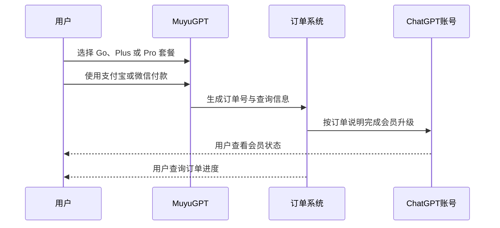

````markdown
# ChatGPT 充值多少钱？Go、Plus、Pro 5X、Pro 20X 价格与选择指南

> 最后更新时间：2026 年 8 月  
> 适用对象：准备购买 ChatGPT 会员，但不确定 Go、Plus、Pro 5X、Pro 20X 应该怎么选的中文用户。

很多用户第一次充值 ChatGPT 会员时，最先问的不是功能，而是：

- ChatGPT Plus 充值多少钱？
- Go、Plus 和 Pro 有什么区别？
- Plus 够不够用？
- Pro 5X 和 Pro 20X 应该怎么选？
- 国内可以使用支付宝或微信支付吗？
- 充值是否需要提供账号密码？
- 付款以后多久可以到账？

本文将从官方套餐价格、实际使用强度、人民币充值方式、账号安全、到账和退款等方面，完整说明应该如何选择。

---

## 先说结论

如果你只是偶尔聊天、写短文、翻译或查询资料，**ChatGPT Go 通常已经够用**。

如果你每天都需要使用 ChatGPT 写作、办公、处理文件、生成图片或辅助编程，**ChatGPT Plus 是大多数人的主力选择**。

如果你经常运行长任务、分析大量文件、编写代码，或者 Plus 经常达到使用限制，可以考虑 **ChatGPT Pro 5X**。

如果你属于专业重度用户，ChatGPT 已经成为主要生产工具，需要更高额度和更长时间运行复杂任务，才需要考虑 **ChatGPT Pro 20X**。

```mermaid
flowchart TD
    A[你每天使用 ChatGPT 吗？] -->|偶尔使用| B[选择 ChatGPT Go]
    A -->|每天使用| C{Plus 的额度通常够用吗？}
    C -->|够用| D[选择 ChatGPT Plus]
    C -->|经常达到限制| E{是否持续进行重度任务？}
    E -->|中高强度| F[选择 Pro 5X]
    E -->|专业重度或长任务| G[选择 Pro 20X]
````

---

## 一、ChatGPT 官方套餐价格是多少？

OpenAI 当前面向个人用户提供 Go、Plus 和 Pro 等付费套餐。

| 套餐              |   官方参考月费 | 主要定位             |
| --------------- | -------: | ---------------- |
| ChatGPT Go      |   8 美元/月 | 低价入门与日常轻度使用      |
| ChatGPT Plus    |  20 美元/月 | 高级功能与日常高频使用      |
| ChatGPT Pro 5X  | 100 美元/月 | 约为 Plus 5 倍使用额度  |
| ChatGPT Pro 20X | 200 美元/月 | 约为 Plus 20 倍使用额度 |

需要注意：

1. 官方价格通常以美元显示；
2. Go 在部分国家和地区可能显示本地货币价格；
3. 实际付款可能受到汇率、银行卡手续费和税费影响；
4. 不同地区可以看到的套餐和支付方式可能不同；
5. 套餐功能和额度可能随时调整；
6. ChatGPT 会员费用不包含 OpenAI API 费用。

因此，搜索“ChatGPT Plus 充值多少钱”时，不能只比较一个固定人民币数字，还需要比较支付方式、交付方式、账号控制权和售后规则。

---

## 二、为什么人民币充值价格和官方美元价格不同？

国内用户实际支付的人民币价格，通常会受到以下因素影响：

```mermaid
flowchart LR
    A[官方美元价格] --> B[人民币实时汇率]
    B --> C[支付通道成本]
    C --> D[地区税费或银行卡手续费]
    D --> E[订单处理与售后成本]
    E --> F[最终人民币价格]
```

例如，ChatGPT Plus 官方参考价格是每月 20 美元，但用户通过不同银行卡、应用商店或第三方充值协助渠道购买时，最终人民币成本可能并不完全一样。

常见影响因素包括：

* 美元兑人民币汇率变化；
* 银行跨境支付手续费；
* Apple App Store 或 Google Play 的地区价格；
* 支付渠道处理成本；
* 订单处理和售后服务成本；
* 商品促销或价格调整。

MuyuGPT 的具体人民币价格由产品页面实时展示，购买前可以查看：

[MuyuGPT ChatGPT Go、Plus、Pro 实时充值价格](https://muyugpt.com/chatgpt)

文章不长期写死人民币售价，是为了避免价格调整后误导用户。

---

## 三、ChatGPT Go 适合哪些人？

ChatGPT Go 是价格较低的入门付费套餐。

它更适合以下情况：

* 每周只使用几次 ChatGPT；
* 主要进行日常聊天和简单问答；
* 偶尔写短文、邮件或社交媒体内容；
* 进行基础翻译和资料整理；
* 偶尔使用联网搜索；
* 对超长任务和高额度没有强烈需求；
* 第一次购买付费套餐，想先低成本体验。

### Go 的优点

* 价格相对较低；
* 比免费版拥有更多可用额度；
* 适合轻度学习和办公；
* 对第一次升级的用户压力较小。

### Go 的局限

* 总体使用额度低于 Plus 和 Pro；
* 不适合长时间、高频率运行复杂任务；
* 重度文件分析和高频生成任务可能较快达到限制。

**适合人群：**

学生、轻度办公用户、偶尔使用 ChatGPT 的个人用户，以及第一次尝试付费套餐的人。

---

## 四、ChatGPT Plus 为什么是主力选择？

ChatGPT Plus 通常是个人用户中最均衡的一档。

它适合以下任务：

* 每天写文章、文案和邮件；
* 翻译和润色长文本；
* 上传 PDF、表格、图片等文件；
* 使用高级模型和多模态功能；
* 进行联网搜索和资料研究；
* 辅助编程、调试和数据分析；
* 生成图片；
* 处理学习和办公任务；
* 希望在繁忙时段获得更稳定的使用体验。

### Plus 的主要优势

* 高于免费版和 Go 的使用额度；
* 能使用更多高级功能；
* 更适合日常高频使用；
* 价格明显低于 Pro；
* 对多数个人用户来说性价比较平衡。

### Plus 不等于无限使用

这是很多用户容易误解的地方。

ChatGPT Plus 并不代表：

* 所有模型无限使用；
* 所有功能没有额度；
* 任何时间都不会受到限制；
* 文件、图片和长任务完全不受限制。

不同模型和工具可能有动态额度，OpenAI 也可能根据系统负载调整限制。

**适合人群：**

自媒体创作者、学生、教师、程序员、设计师、办公人员以及每天使用 ChatGPT 的个人用户。

---

## 五、ChatGPT Pro 5X 适合哪些人？

Pro 5X 的核心价值，不是“回答质量比 Plus 高五倍”，而是提供更高的使用额度。

适合以下情况：

* Plus 经常达到使用限制；
* 每天需要进行大量长对话；
* 经常分析多个文件或长文档；
* 需要运行复杂编程和数据任务；
* 每天长时间进行资料研究；
* 同时处理多个内容生产任务；
* ChatGPT 已经直接参与工作交付；
* 额度不足会影响工作效率。

### 什么时候没必要买 Pro 5X？

如果你使用 Plus 时：

* 很少看到额度提醒；
* 每天只使用一两个小时；
* 主要进行简单问答和写作；
* 没有长时间运行复杂任务；

那么直接购买 Pro 5X，可能并不划算。

**适合人群：**

高频程序员、研究人员、专业内容创作者、AI 重度用户和小型内容团队。

---

## 六、ChatGPT Pro 20X 适合哪些人？

Pro 20X 面向非常高频、非常重度的专业使用场景。

典型需求包括：

* 长时间运行复杂任务；
* 每天进行大量深度研究；
* 高频编程和数据分析；
* 多个任务同时进行；
* 需要较高的优先访问能力；
* ChatGPT 已经成为主要生产工具；
* 使用额度不足会直接影响项目进度；
* 使用 ChatGPT 获得的工作收益明显高于会员成本。

### 普通用户不建议盲目购买

Pro 20X 的价格较高。

如果只是：

* 偶尔写文章；
* 查询资料；
* 翻译文本；
* 每天使用时间不长；

通常没有必要直接购买最高档。

**适合人群：**

专业开发者、研究人员、重度创作者、AI 服务团队，以及依赖 ChatGPT 完成高强度工作的用户。

---

## 七、Go、Plus、Pro 应该怎么选？

可以根据自己的实际使用情况判断：

| 使用情况            | 推荐套餐         | 主要原因          |
| --------------- | ------------ | ------------- |
| 每周使用几次          | Go           | 成本低，满足基础问答与写作 |
| 每天使用一到三小时       | Plus         | 功能和价格比较均衡     |
| Plus 经常达到限制     | Pro 5X       | 使用额度更高        |
| 全天进行专业重度工作      | Pro 20X      | 适合长任务和高强度使用   |
| 第一次购买，不确定需求     | Plus         | 最容易判断是否满足需要   |
| 只是偶尔体验付费功能      | Go           | 没有必要直接购买 Pro  |
| ChatGPT 已直接创造收入 | Pro 5X 或 20X | 根据使用额度和收益判断   |

最重要的选择原则是：

> 不要因为套餐越贵，就认为一定越适合自己。
> 应该根据自己是否真正遇到额度不足来升级。

---

## 八、官方订阅和第三方充值有什么区别？

### 官方订阅

用户直接在 ChatGPT 官方页面购买会员。

#### 优点

* 直接与 OpenAI 建立订阅关系；
* 可以在 ChatGPT 账号中管理套餐；
* 可以查看官方账单；
* 适合拥有可用国际支付方式的用户。

#### 可能遇到的问题

* 银行卡不支持国际线上支付；
* 银行拦截跨境交易；
* 账单地址不匹配；
* 身份验证失败；
* 地区或支付方式不受支持；
* 国内常用的支付宝或微信不一定直接显示；
* 汇率和手续费不确定。

---

### 第三方充值协助

用户使用人民币支付，由独立第三方平台协助完成会员升级。

MuyuGPT 当前提供：

* 支付宝支付；
* 微信支付；
* 充值到本人账号；
* 无需提供账号密码；
* 订单号与订单查询；
* 充值不成功全额退款；
* 正常订单通常可以较快处理；
* 客服时间为 8:30～22:30。

需要明确：

> MuyuGPT 是独立第三方 AI 会员充值协助平台，与 OpenAI 不存在官方隶属、授权或合作关系。

用户应该根据自己的支付条件、风险接受程度和售后需求，选择适合自己的购买方式。

---

## 九、MuyuGPT 的 ChatGPT 充值流程



具体步骤如下：

1. 打开 [MuyuGPT ChatGPT 充值页面](https://muyugpt.com/chatgpt)；
2. 选择 ChatGPT Go、Plus、Pro 5X 或 Pro 20X；
3. 点击对应套餐的“立即购买”；
4. 使用支付宝或微信完成付款；
5. 保存订单号和订单查询信息；
6. 按订单页面要求提交必要信息；
7. 等待订单处理；
8. 登录 ChatGPT 查看会员状态；
9. 如需确认处理进度，进入订单查询页面。

不要在支付完成后重复创建多个订单。

---

## 十、充值需要提供账号密码吗？

正常情况下，不需要提供：

* ChatGPT 登录密码；
* 邮箱登录密码；
* 短信验证码；
* 邮箱验证码；
* 账号恢复代码；
* Cookie；
* Session Token；
* API Key。

如果任何个人或平台以“充值”为由要求你发送这些敏感信息，应立即停止操作。

MuyuGPT 当前的 ChatGPT 充值页面明确说明，无需用户提供账号密码。

---

## 十一、ChatGPT 充值多久到账？

到账时间可能受到以下因素影响：

* 支付是否成功；
* 用户提交的信息是否正确；
* 当前订单数量；
* ChatGPT 服务状态；
* 网络或地区环境；
* 支付通道是否延迟；
* 订单是否需要人工核查。

正常订单通常可以较快处理，但不能把“平均较快到账”理解为任何情况下都不会延迟。

如果长时间没有到账：

1. 不要重复付款；
2. 保存订单号；
3. 检查订单查询页面；
4. 确认提交的信息是否正确；
5. 退出 ChatGPT 后重新登录；
6. 查看账号中的套餐状态；
7. 联系客服核查订单。

---

## 十二、充值失败怎么办？

常见原因包括：

* 支付过程中关闭页面；
* 用户提交的信息错误；
* ChatGPT 服务暂时异常；
* 网络或地区环境异常；
* 订单状态尚未同步；
* 用户重复创建多个订单；
* 商品或支付通道临时维护。

遇到问题时，不要连续重复付款。

建议：

1. 查询现有订单；
2. 截图保存支付记录；
3. 核对订单号；
4. 联系客服核查；
5. 按退款政策处理。

MuyuGPT 当前规则为：

> 充值不成功，全额退款。

具体退款条件、处理时间和售后范围，以商品页面及退款政策为准。

---

## 十三、购买 ChatGPT 会员最容易踩的五个坑

### 1. 只比较价格，不看交付方式

购买前必须确认：

* 是充值到本人账号；
* 是卡密自助充值；
* 是成品账号；
* 还是其他交付方式。

价格相近，不代表交付方式和账号控制权相同。

---

### 2. 把 Plus 理解为无限额度

Plus 的额度可能动态变化。

购买 Plus 后，仍然可能遇到：

* 某个模型暂时达到限制；
* 文件上传受到限制；
* 图片生成额度变化；
* 高峰期部分功能调整。

---

### 3. 第一次购买就选择最高套餐

Pro 20X 不一定比 Plus 更适合普通用户。

正确做法是：

1. 先判断每天使用时长；
2. 确认 Plus 是否经常达到限制；
3. 再决定是否升级 Pro。

---

### 4. 把账号密码交给陌生人

账号密码、验证码和恢复代码一旦泄露，可能导致：

* 账号被盗；
* 聊天记录泄露；
* 邮箱被修改；
* 账号无法找回。

---

### 5. 支付失败后反复下单

重复付款可能导致多个订单同时存在。

遇到支付或到账问题，应先查询原订单，而不是立即重新付款。

---

## 十四、常见问题

### ChatGPT Plus 充值后会自动续费吗？

通过第三方完成的单次充值，通常不会直接从用户的支付宝或微信中自动续扣。

会员到期以后是否需要重新购买，应以订单和商品说明为准。

---

### ChatGPT Plus 和 OpenAI API 是一回事吗？

不是。

ChatGPT Plus 是 ChatGPT 网页端和客户端的个人会员。

OpenAI API 面向开发者，按照实际调用量单独计费。购买 Plus 不会自动获得 API 余额。

---

### 充值后原来的聊天记录会消失吗？

如果是升级用户原来的本人账号，正常情况下原有聊天记录仍然保留。

购买前仍建议确认交付方式。

---

### 可以先购买 Go，以后再升级 Plus 吗？

能否在当前计费周期内直接升级，应以 ChatGPT 账号页面和订单规则为准。

不确定时，可以购买前咨询客服。

---

### Pro 5X 和 Pro 20X 的回答质量一样吗？

两档 Pro 的核心能力接近，主要区别是使用额度。

不能简单理解为 Pro 20X 的回答质量是 Pro 5X 的四倍。

---

### 哪个套餐性价比最高？

对大多数日常高频用户来说，Plus 通常最均衡。

轻度用户选择 Go 更省钱。

只有经常达到 Plus 限制时，才有必要考虑 Pro 5X 或 Pro 20X。

---

### 为什么文章里的价格和购买页面可能不同？

人民币价格会受到汇率、活动和支付通道成本影响。

购买时应以产品页面实时显示的价格为准。

---

## 十五、总结

选择 ChatGPT 套餐时，最重要的不是购买最贵的一档，而是匹配自己的真实使用强度：

* 轻度使用：ChatGPT Go；
* 日常高频使用：ChatGPT Plus；
* 中高强度专业使用：Pro 5X；
* 专业满负荷使用：Pro 20X。

购买前需要确认：

* 当前实时价格；
* 套餐使用额度；
* 充值到本人账号还是其他交付方式；
* 是否需要提供敏感信息；
* 到账和订单查询方式；
* 充值失败后的退款规则；
* 服务平台是否明确说明第三方身份。

查看当前人民币价格、套餐权益和购买入口：

[MuyuGPT｜ChatGPT Go、Plus、Pro 会员充值](https://muyugpt.com/chatgpt)

---

## 相关阅读

* [ChatGPT Plus 支付失败怎么办？](chatgpt-plus-payment-failed.md)
* [ChatGPT Plus 和 ChatGPT Pro 有什么区别？](chatgpt-plus-vs-pro.md)
* [ChatGPT Plus 怎么用支付宝微信充值？](chatgpt-plus-pro-alipay-wechat-recharge.md)
* [ChatGPT 官方订阅和第三方充值有什么区别？](chatgpt-recharge-vs-official-subscription.md)

---

## 资料来源

* OpenAI ChatGPT 官方定价页面
* OpenAI ChatGPT Go 产品说明
* OpenAI ChatGPT Plus 产品说明
* OpenAI ChatGPT Pro 套餐说明
* MuyuGPT ChatGPT 充值产品页面

> 免责声明：本文仅用于介绍不同 ChatGPT 套餐和充值方式，不构成 OpenAI 官方说明。产品功能、额度、价格和服务规则可能调整，请以 OpenAI 与 MuyuGPT 当前页面显示的信息为准。

```

文中的官方参考价格为 Go 8 美元、Plus 20 美元；OpenAI 现有 Pro 档位分别为每月 100 美元的 5X 用量和每月 200 美元的 20X 用量。MuyuGPT 当前产品页展示人民币套餐与支付信息，价格应以下单页实时显示为准。:contentReference[oaicite:0]{index=0}
```
