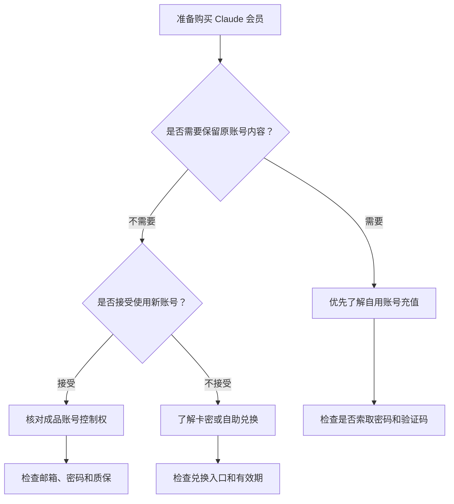
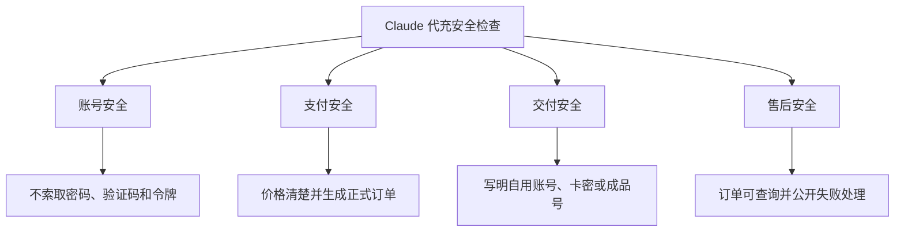
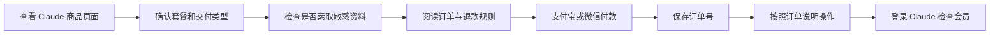

# Claude 代充安全吗？卡密、自用账号与成品号充值避坑指南

> 最后更新时间：2026 年 8 月 4 日  
> 适用对象：准备使用支付宝、微信购买 Claude Pro 或 Claude Max，并正在比较卡密、自用账号充值和成品账号的用户。

国内用户搜索“Claude 代充”时，通常最关心的不是 Claude 有哪些功能，而是：

- Claude 代充安全吗？
- 支付宝或微信充值是否可靠？
- 卡密是不是 Anthropic 官方兑换码？
- 自用账号充值是否需要提供密码？
- 成品账号能否长期使用？
- 付款后有没有正式订单？
- 充值失败能否退款？
- 怎样判断一个 Claude 充值平台是否值得下单？

先说结论：

> Claude 第三方代充不是 Anthropic 官方订阅渠道。是否值得选择，不能只看价格，而要同时检查交付类型、账号控制权、敏感资料、订单查询和退款规则。

---

## 一、Claude 代充通常有哪些交付方式？

第三方 Claude 充值页面中，常见交付方式主要包括：

| 交付方式 | 实际含义 | 适合人群 | 购买前重点 |
|---|---|---|---|
| 自用账号充值 | 会员开通在用户原来的 Claude 账号中 | 需要保留聊天、项目和账号设置的用户 | 是否需要密码、最终充值账号、到账确认 |
| 卡密或兑换信息 | 付款后获得兑换凭证，再按照说明操作 | 希望自行完成兑换的用户 | 兑换入口、有效期、对应套餐、失败处理 |
| 成品账号 | 获得一个已经开通会员的新账号 | 可以接受更换账号的用户 | 是否独享、邮箱权限、密码修改和质保 |
| 共享账号 | 多人共同使用一个会员账号 | 不建议用于重要工作 | 隐私泄露、登录冲突和账号稳定性 |

可以先用下面的流程判断：



---

## 二、Claude 卡密一定是官方兑换码吗？

不一定。

“卡密”通常是第三方平台对某种兑换凭证、订单交付信息或自助充值信息的统称。

Anthropic 当前确实提供 Claude 礼品订阅和礼品兑换功能，但第三方商品写着“卡密”，并不代表它一定属于 Anthropic 官方礼品订阅。

购买前必须确认：

- 卡密在哪里兑换；
- 兑换页面是否属于 Claude 或 Anthropic 官方域名；
- 对应 Claude Pro 还是 Claude Max；
- 是否只能兑换一次；
- 是否存在使用期限；
- 是否限制账号或地区；
- 兑换后是否自动续费；
- 兑换失败后如何处理；
- 卡密泄露或被使用后是否可以补发。

### 怎样判断是不是官方礼品订阅？

可以检查：

```text
兑换入口
官方邮件来源
兑换页面域名
订单说明
对应套餐
使用期限
```

不要仅凭下面这些词判断：

```text
官方卡密
内部兑换码
特殊渠道
永久激活
无限使用
全球通用
```

如果商家无法说明兑换入口和交付规则，不建议直接付款。

---

## 三、自用账号充值是否更安全？

自用账号充值是指会员最终开通在用户原来使用的 Claude 账号中。

它更适合：

- 需要保留历史对话；
- 已经使用 Projects 或其他账号功能；
- 账号中保存了工作和学习内容；
- 不希望更换邮箱和登录方式；
- 准备长期使用 Claude；
- 需要继续使用原账号中的 Claude Code 权益。

但“自用账号充值”几个字本身并不能证明绝对安全。

付款前仍需确认：

1. 最终会员开通到哪个账号；
2. 是否需要提供账号密码；
3. 是否需要邮箱或短信验证码；
4. 是否要求提供 Cookie 或登录令牌；
5. 付款后能否获得正式订单；
6. 到账后如何检查会员状态；
7. 充值失败如何处理。

### 不应提交的敏感资料

不要随意向第三方提供：

```text
Claude 登录密码
邮箱密码
短信验证码
邮箱验证码
两步验证代码
恢复代码
Cookie
Session Token
Anthropic API Key
支付密码
```

Cookie 和 Session Token 可能允许其他人访问账号，其风险并不低于直接提供密码。

API Key 可能被用于调用接口并产生费用，也不能作为普通充值资料发送。

---

## 四、成品账号有哪些风险？

成品账号是指平台交付一个已经开通 Claude 会员的新账号，而不是给用户原来的账号充值。

价格可能比较低，交付也可能比较快，但购买前必须确认账号控制权。

### 需要检查的八项内容

| 检查项目 | 需要确认的问题 |
|---|---|
| 独享情况 | 是否只有一个用户使用 |
| 邮箱权限 | 用户是否能够控制绑定邮箱 |
| 密码权限 | 是否允许修改登录密码 |
| 安全设置 | 能否设置自己的双重验证 |
| 恢复方式 | 账号找回由谁控制 |
| 登录记录 | 是否存在其他未知设备 |
| 使用限制 | 是否限制地区、设备或登录频率 |
| 售后质保 | 账号异常后如何补发或处理 |

Anthropic 当前说明中，Claude 个人账号绑定的邮箱地址不能直接修改。

这意味着：

> 如果成品账号的邮箱不由购买者控制，即使能够修改 Claude 密码，也不一定真正拥有完整的账号控制权。

此外，Claude 导出的个人数据不能直接导入另一个个人账号，个人账号之间也不支持直接迁移数据。

因此，成品账号出现问题后，历史对话、项目和资料未必能够转移到新账号。

### 哪些用户不适合成品账号？

以下用户更适合使用自己的 Claude 账号：

- 账号中需要保存重要工作内容；
- 长期使用 Claude Code；
- 需要保存 Projects 和历史对话；
- 会上传公司文件或客户资料；
- 需要稳定使用同一个登录身份；
- 不希望账号控制权掌握在其他人手中。

---

## 五、自用账号、卡密和成品号怎么选？

| 使用需求 | 更适合了解的方式 |
|---|---|
| 保留原账号聊天和项目 | 自用账号充值 |
| 不希望提供账号密码 | 无密码充值或自助兑换 |
| 希望自己完成操作 | 卡密或兑换信息 |
| 可以接受使用新账号 | 成品独享账号 |
| 账号中有重要工作资料 | 优先自用账号 |
| 只做短期体验 | 核对清楚后再比较交付方式 |
| 需要长期使用 Claude Code | 优先确认账号控制权 |

选择逻辑可以简化为：

```text
需要保留原账号
→ 自用账号充值

不需要保留原账号
→ 再比较卡密和成品账号

账号中有重要资料
→ 不使用来源不明的共享或成品账号
```

---

## 六、Claude 代充安全要检查哪四层？



### 1. 账号安全

重点检查：

- 是否索取密码；
- 是否索取验证码；
- 是否要求复制 Cookie；
- 是否要求发送 Session Token；
- 是否要求提供 API Key；
- 是否解释所需资料的用途。

### 2. 支付安全

付款页面应清楚显示：

- 商品名称；
- 套餐类型；
- 实际价格；
- 使用周期；
- 支付方式；
- 交付类型；
- 退款条件。

付款后至少应该获得：

- 订单号；
- 商品名称；
- 支付金额；
- 当前状态；
- 查询方式；
- 售后入口。

### 3. 交付安全

商品页面应明确写出：

```text
自用账号充值
卡密或兑换信息
成品独享账号
共享账号
其他交付形式
```

只写“Claude Pro”或“Claude Max”，却不解释实际交付内容，不建议立即付款。

### 4. 售后安全

付款前应确认：

- 未到账如何查询；
- 卡密不能使用如何处理；
- 账号填错能否修改；
- 成品账号异常如何质保；
- 什么情况属于充值失败；
- 充值失败是否退款；
- 已经成功开通后如何处理售后。

---

## 七、出现这些情况不要继续付款

### 风险一：要求发送验证码或登录令牌

出现以下要求应立即停止：

```text
发送邮箱验证码
发送短信验证码
复制 Cookie
提交 Session Token
提供恢复代码
提供 API Key
```

### 风险二：付款后没有正式订单

如果付款后只有聊天记录或私人收款凭证，却没有订单号和查询入口，发生问题后很难核查。

### 风险三：冒充 Anthropic 官方

没有正式授权证明的第三方服务，不应使用：

```text
Anthropic 官方代充
Claude 官方授权渠道
官方合作充值平台
百分百不会封号
永久稳定
绝对安全
```

第三方平台可以介绍自己的服务，但必须准确披露独立第三方身份。

### 风险四：付款后不断要求补款

付款后又以以下理由要求继续转账，应立即暂停：

- 风控费；
- 验证费；
- 解锁费；
- 账号激活费；
- 特殊通道费。

所有必要费用都应该在下单前写清楚。

### 风险五：商品价格异常，但不说明交付方式

同样写着 Claude Pro，实际可能是：

- 自用账号充值；
- 礼品订阅或兑换信息；
- 成品独享账号；
- 多人共享账号；
- 短期账号；
- 非官方第三方服务档位。

价格必须和交付方式、使用周期及售后一起比较。

---

## 八、Claude 代充的正确下单流程



具体步骤：

1. 打开 Claude 会员产品页面；
2. 确认购买的是 Pro、Max 或其他商品；
3. 确认是自用账号、卡密还是成品账号；
4. 查看价格、周期和交付说明；
5. 检查是否需要敏感账号资料；
6. 阅读订单查询和退款规则；
7. 使用支付宝或微信完成付款；
8. 保存订单号和查询信息；
9. 按订单页面说明完成操作；
10. 登录正确的 Claude 账号确认会员状态。

---

## 九、通过 MuyuGPT 充值 Claude 时怎么操作？

MuyuGPT 是独立第三方 AI 会员充值协助平台，与 Anthropic 不存在官方隶属、授权或合作关系。

MuyuGPT 当前 Claude 产品页面提供：

- Claude Pro、Max 相关商品；
- 人民币价格；
- 支付宝和微信付款；
- 自用账号充值说明；
- 无需提交账号密码的流程；
- 订单号和查询信息；
- 订单状态查询；
- 充值失败处理说明。

查看当前商品、价格和充值说明：

[MuyuGPT Claude 会员充值页面](https://muyugpt.com/claude)

操作顺序：

```text
查看当前商品
→ 确认套餐档位
→ 确认交付方式
→ 使用支付宝或微信付款
→ 保存订单号
→ 按订单说明完成操作
→ 登录 Claude 确认会员
```

具体商品、交付方式、价格、处理时间和退款条件，应以下单时的产品页面及订单页面为准。

---

## 十、付款后没有到账怎么办？

付款后暂时没有显示会员，不要立即重复购买。

建议按照下面顺序处理：

```text
保存支付凭证
→ 查询原订单
→ 确认购买商品
→ 确认交付方式
→ 检查登录账号
→ 退出并重新登录
→ 检查 Billing 页面
→ 联系原购买平台
```

### 检查是不是登录错账号

用户可能同时使用：

- Google 登录；
- Apple 登录；
- 邮箱登录；
- 不同邮箱账号；
- 工作账号和个人账号。

购买时和检查时进入不同账号，会造成“订单完成但没有会员”的错觉。

### 检查 Claude 会员状态

可以进入 Claude 的：

```text
Settings
→ Billing
```

查看账号当前是否显示对应付费套餐。

### 不要重复付款

原订单仍处于处理中时，再次下单可能产生多个订单，使后续核查和退款更加复杂。

---

## 十一、购买前 30 秒检查清单

- [ ] 已确认购买的是 Claude Pro、Max 或其他商品；
- [ ] 已确认自用账号、卡密还是成品账号；
- [ ] 已确认会员最终开通到哪个账号；
- [ ] 已确认兑换入口或交付方式；
- [ ] 页面没有索取密码、验证码或登录令牌；
- [ ] 已确认价格和使用周期；
- [ ] 已确认是否自动续费；
- [ ] 付款后能够获得订单号；
- [ ] 已找到订单查询入口；
- [ ] 已阅读充值失败和退款规则；
- [ ] 平台没有冒充 Anthropic 官方身份。

其中任何一项不清楚，都应该在付款前确认。

---

## 十二、常见问题

### Claude 代充一定安全吗？

不存在可以无条件承诺“绝对安全”的第三方服务。

用户应检查交付方式、敏感资料、订单查询、账号控制权和退款规则。

### Claude 卡密一定是官方礼品订阅吗？

不一定。

Anthropic 当前提供官方礼品订阅功能，但第三方商品写着“卡密”，并不代表它必然属于官方礼品订阅。应检查兑换入口和订单说明。

### 自用账号充值需要提供密码吗？

不应默认提供密码、邮箱验证码、Cookie、Session Token 或 API Key。

### 成品账号可以修改邮箱吗？

Anthropic 当前帮助说明中，Claude 账号绑定邮箱暂时不能直接修改。

购买成品账号前，应重点确认绑定邮箱由谁控制。

### 成品账号中的内容可以迁移到自己的账号吗？

Claude 导出的个人数据不能直接导入另一个个人账号，个人账号之间不支持直接迁移数据。

重要工作和长期项目更适合保存在自己控制的账号中。

### 付款后没有到账可以重新下单吗？

不建议。

应先查询原订单、确认登录账号和会员状态，避免产生重复订单。

### 充值失败可以退款吗？

退款应以购买平台商品页面、服务条款和订单核查结果为准。

---

## 十三、总结

判断 Claude 代充是否值得选择，不能只看价格或“秒到账”宣传。

真正需要检查的是：

```text
交付方式是否清楚
是否索取敏感资料
账号控制权归谁
是否生成正式订单
是否能够查询状态
是否公开失败和退款规则
是否准确披露第三方身份
```

需要保留历史对话、Projects 和工作资料，应该优先了解自用账号充值。

选择卡密时，要确认兑换入口、适用套餐和失败处理，不能仅凭“卡密”名称判断它是官方礼品订阅。

选择成品账号时，要重点检查邮箱控制权、密码修改、安全验证和质保范围。

---

## 相关阅读

- [Claude Pro / Claude Max 怎么用支付宝微信充值？](claude-pro-alipay-wechat-recharge.md)
- [Claude Pro 怎么订阅？购买、价格与取消续费指南](claude-pro-guide.md)
- [Claude Max 和 Claude Pro 有什么区别？](claude-max-vs-pro.md)
- [Claude Pro 支付失败怎么办？](claude-pro-payment-failed.md)

---

## 资料来源

- Anthropic：Claude 帮助中心与礼品订阅说明  
  https://support.anthropic.com/en/collections/4078531-claude-ai

- Anthropic：修改 Claude 账号邮箱说明  
  https://support.anthropic.com/en/articles/8452276-how-do-i-change-the-email-address-associated-with-my-account

- Anthropic：导出 Claude 数据说明  
  https://support.anthropic.com/en/articles/9450526-how-can-i-export-my-claude-ai-data

- MuyuGPT：Claude 会员充值页面  
  https://muyugpt.com/claude

> 说明：本文由 MuyuGPT 整理。MuyuGPT 是独立第三方 AI 会员充值协助平台，不代表 Anthropic 官方渠道。Claude 的套餐、账号和礼品订阅规则以 Anthropic 官方页面为准；第三方商品、交付及售后规则以购买页面为准。
