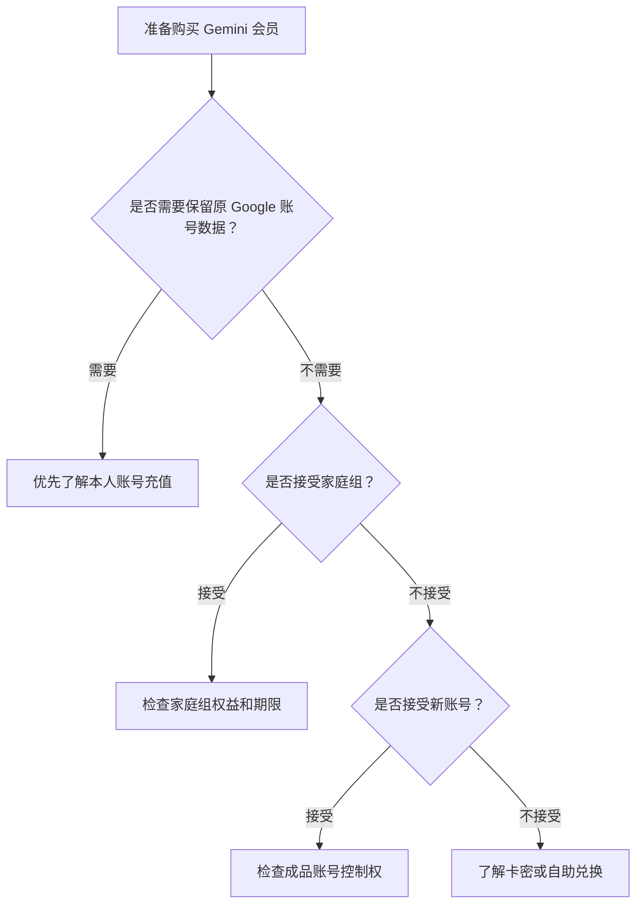
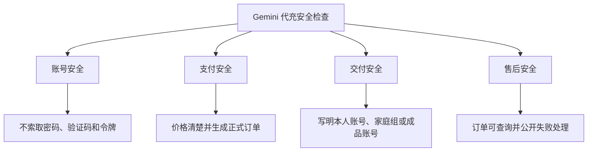
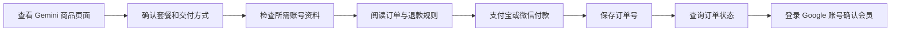

# Gemini 代充安全吗？本人 Google 账号、家庭组与成品号避坑指南

> 最后更新时间：2026 年 8 月 5 日  
> 适用对象：准备使用支付宝、微信购买 Google AI Pro 或 Gemini 相关会员，并正在比较本人账号、家庭组和成品账号的用户。

国内用户搜索“Gemini 充值”或“Google AI Pro 代充”时，通常最关心下面这些问题：

- Gemini 代充安全吗？
- 会员会开通到自己的 Google 账号吗？
- 是否需要提供 Google 密码或验证码？
- 家庭组邀请和本人账号充值有什么区别？
- 成品账号能否长期使用？
- 付款后如何确认 Google AI Pro 已开通？
- 充值失败能否退款？
- 怎样判断一个 Gemini 充值平台是否值得下单？

先说结论：

> 第三方充值不是 Google 官方订阅渠道。是否值得选择，不能只看价格，而要同时检查 Google 账号控制权、交付方式、敏感资料、订单查询和退款规则。

---

## 一、Gemini 充值通常有哪些交付方式？

第三方 Gemini 商品中，常见交付方式主要包括：

| 交付方式 | 实际含义 | 更适合谁 | 购买前重点 |
|---|---|---|---|
| 本人 Google 账号充值 | 会员开通到用户原来的 Google 账号 | 需要保留 Gmail、Drive 和 Gemini 数据的用户 | 账号是否正确、资料安全、到账确认 |
| 家庭组邀请 | 用户加入已有 Google 家庭组并获得部分会员权益 | 能接受家庭组规则的用户 | 邀请期限、退出限制、权益范围 |
| 卡密或兑换信息 | 用户获得兑换信息并自行操作 | 希望自助完成的用户 | 兑换入口、有效期、适用账号 |
| 成品账号 | 平台交付一个已开通会员的新 Google 账号 | 可以接受更换账号的用户 | 邮箱控制权、恢复方式、质保 |
| 共享账号 | 多人共同使用同一个账号 | 不建议用于重要资料 | 隐私、登录冲突和账号稳定性 |

可以先按照下面的流程判断：



---

## 二、本人 Google 账号充值是什么意思？

本人账号充值，是指 Google AI Pro 或相关会员权益最终开通在用户原来使用的 Google 账号中。

这种方式更适合：

- 长期使用同一个 Gmail；
- 需要保留 Gemini 对话记录；
- 已经使用 Google Drive、Docs 或 Photos；
- 不希望更换登录账号；
- 需要在多个设备上继续使用同一账号；
- 账号中存在重要工作或个人资料。

付款前应确认：

1. 最终会员开通到哪个 Google 账号；
2. 填错邮箱后能否修改；
3. 是否需要提供账号密码；
4. 是否需要验证码或恢复代码；
5. 完成后在哪里确认会员；
6. 充值失败如何处理。

Google AI Pro 会员由 Google One 系统管理，因此到账后应检查 Google One 或 Gemini 中显示的订阅状态。

---

## 三、家庭组邀请和本人账号充值有什么区别？

部分第三方商品可能通过 Google 家庭组交付会员权益。

家庭组方式并不等于把完整订阅直接购买到用户账号。

### 家庭组方式可能涉及

- 用户加入另一个账号创建的家庭组；
- 用户获得部分可共享的会员权益；
- 家庭管理员由其他账号控制；
- 权益持续时间与家庭组状态有关；
- 退出或更换家庭组可能受到规则限制。

Google 当前说明显示，Google AI Pro 家庭组成员可以享受部分 AI 权益，但具体可共享内容和资格应以 Google 当前规则为准。

### 购买家庭组商品前要确认

```text
由谁创建家庭组
邀请可以维持多久
是否为固定期限
能够获得哪些权益
能否正常使用 Gemini
是否包含云存储权益
退出家庭组后会怎样
家庭管理员移除成员怎么处理
```

### 本人账号充值与家庭组对比

| 对比项目 | 本人账号充值 | 家庭组邀请 |
|---|---|---|
| 使用账号 | 用户原 Google 账号 | 用户原 Google 账号 |
| 订阅控制权 | 通常由用户自己管理 | 可能由家庭管理员控制 |
| 权益稳定性 | 取决于本人订阅状态 | 取决于家庭组状态 |
| 取消管理 | 用户通过 Google One 管理 | 可能需要家庭管理员处理 |
| 适合人群 | 长期稳定使用 | 能接受家庭组规则的用户 |

如果准备长期使用，并且账号中有重要资料，应优先确认订阅控制权归谁。

---

## 四、成品 Google 账号有哪些风险？

成品账号是指平台交付一个已经开通 Gemini 或 Google AI Pro 的新 Google 账号，而不是给用户原账号充值。

购买前必须确认账号控制权。

### 需要检查的八项内容

| 检查项目 | 需要确认的问题 |
|---|---|
| 独享情况 | 是否只有购买者使用 |
| 登录密码 | 是否允许立即修改 |
| 恢复邮箱 | 由谁控制 |
| 恢复手机 | 是否可以更换 |
| 两步验证 | 能否绑定自己的验证方式 |
| 登录设备 | 是否存在其他未知设备 |
| 地区限制 | 是否限制国家、地区或设备 |
| 售后质保 | 账号异常后如何处理 |

只获得登录密码，并不代表完整拥有账号。

如果恢复邮箱和恢复手机仍由其他人控制，对方可能有机会重新获取账号。

### 哪些用户不适合成品账号？

以下用户更适合使用自己的 Google 账号：

- 需要长期保存 Gemini 对话；
- 需要使用 Gmail 和 Google Drive；
- 会上传公司文件或客户资料；
- 需要同步浏览器、照片或通讯录；
- 希望长期使用同一个身份；
- 不愿把账号恢复权交给其他人。

---

## 五、第三方充值不要提供哪些资料？

无论通过哪个第三方平台，都不要随意提供：

```text
Google 账号密码
Gmail 密码
短信验证码
邮箱验证码
Google Authenticator 验证码
备用验证码
账号恢复代码
Cookie
Session Token
Gemini API Key
支付密码
```

验证码、Cookie 和 Session Token 可能被用于登录账号。

备用验证码和恢复代码可能被用于绕过正常验证流程。

Gemini API Key 可能被用于调用接口并产生费用，也不能作为普通会员充值资料发送。

### 出现以下情况应立即停止

- 要求发送 Google 验证码；
- 要求提供两步验证备用码；
- 要求复制浏览器 Cookie；
- 要求提交 Session Token；
- 要求提供 Gemini API Key；
- 付款后不断要求额外补款；
- 付款后没有正式订单；
- 冒充 Google 官方授权渠道。

---

## 六、Gemini 代充安全要检查哪四层？



### 1. 账号安全

重点检查：

- 是否需要密码；
- 是否需要验证码；
- 是否要求关闭两步验证；
- 是否索取 Cookie 或登录令牌；
- 是否需要 API Key；
- 平台为什么需要这些资料。

### 2. 支付安全

付款页面应清楚显示：

- 商品名称；
- 当前价格；
- 使用周期；
- 交付方式；
- 是否自动续费；
- 付款方式；
- 退款条件。

付款后至少应该获得：

- 订单号；
- 商品名称；
- 支付金额；
- 当前状态；
- 查询入口；
- 售后方式。

### 3. 交付安全

商品页面应明确写出：

```text
本人 Google 账号充值
Google 家庭组邀请
卡密或自助兑换
成品独享账号
共享账号
其他交付方式
```

只写“Gemini Pro”或“Google AI Pro”，却不说明实际交付内容，不建议立即付款。

### 4. 售后安全

付款前应确认：

- 未到账如何查询；
- 账号填错怎么处理；
- 家庭组邀请失效怎么办；
- 成品账号异常如何质保；
- 什么情况属于充值失败；
- 充值失败是否退款；
- 退款退到哪里。

---

## 七、出现这些情况不要继续付款

### 风险一：冒充 Google 官方

没有正式授权证明的第三方平台，不应使用：

```text
Google 官方代充
Gemini 官方授权
Google 官方合作渠道
百分百不会封号
永久稳定
绝对安全
```

独立第三方服务可以介绍自己的充值流程，但身份必须准确。

### 风险二：要求关闭账号安全功能

如果平台要求：

- 关闭两步验证；
- 删除恢复邮箱；
- 发送备用验证码；
- 移除安全设备；

应立即停止操作。

### 风险三：付款后没有订单

如果付款后只有聊天记录或个人收款凭证，却没有订单号和查询入口，发生问题后很难核查。

### 风险四：家庭组商品不写期限

家庭组商品必须提前说明：

- 权益周期；
- 邀请有效期；
- 被移除后的处理方式；
- 家庭组异常后的售后规则。

### 风险五：价格很低但不说明交付方式

同样写着 Google AI Pro，实际可能是：

- 本人账号订阅；
- 家庭组邀请；
- 卡密兑换；
- 成品账号；
- 多人共享账号；
- 短期权益。

价格必须与交付方式、周期和售后一起比较。

---

## 八、Gemini 第三方充值的正确流程



具体步骤：

1. 打开 Gemini 会员产品页面；
2. 确认购买的是 Google AI Pro 或其他商品；
3. 确认本人账号、家庭组、卡密还是成品账号；
4. 查看价格、周期和交付说明；
5. 检查是否索取敏感资料；
6. 阅读订单查询与退款规则；
7. 使用支付宝或微信付款；
8. 保存订单号和查询信息；
9. 按订单说明完成操作；
10. 登录正确的 Google 账号确认会员状态。

---

## 九、如何确认 Google AI Pro 已经到账？

完成付款或交付后，应同时检查下面几项：

```text
订单状态是否已经完成
登录账号是否正确
Google One 是否显示对应会员
Gemini 是否显示付费权益
云存储或相关权益是否生效
```

Google AI Pro 由 Google One 管理。

用户可以在 Gemini 或 Google One 的会员管理页面检查订阅状态。

如果暂时没有显示：

```text
保存支付凭证
→ 查询原订单
→ 确认 Google 账号
→ 退出并重新登录
→ 检查 Google One
→ 检查 Gemini
→ 联系原购买平台
```

不要仅根据某一次模型使用限制判断会员是否到账。

---

## 十、通过 MuyuGPT 充值 Gemini 时怎么操作？

MuyuGPT 是独立第三方 AI 会员充值协助平台，与 Google 不存在官方隶属、授权或合作关系。

MuyuGPT 当前 Gemini 产品页面提供：

- Gemini 和 Google AI Pro 相关商品；
- 人民币价格；
- 支付宝和微信付款；
- 交付方式说明；
- 订单号和查询信息；
- 订单状态查询；
- 充值失败处理说明。

查看当前商品、人民币价格和充值说明：

[MuyuGPT Gemini 会员充值页面](https://muyugpt.com/gemini)

操作顺序：

```text
查看当前商品
→ 确认套餐和交付方式
→ 阅读订单与退款规则
→ 使用支付宝或微信付款
→ 保存订单号
→ 查询处理状态
→ 登录 Google 账号确认会员
```

具体商品、价格、交付方式、处理时间和退款条件，应以下单时的产品页面及订单状态为准。

---

## 十一、付款后没有到账怎么办？

付款后暂时没有显示会员，不要立即重复购买。

建议按照下面顺序处理：

```text
保存支付凭证
→ 查询原订单
→ 确认购买商品
→ 确认交付方式
→ 检查 Google 账号
→ 退出并重新登录
→ 检查 Google One
→ 联系原购买平台
```

### 检查是不是登录错账号

用户可能同时拥有：

- 个人 Gmail；
- 工作 Google 账号；
- 学校账号；
- 多个不同 Gmail；
- 浏览器中多个登录账号。

购买时和检查时进入不同账号，会造成“订单完成但没有会员”的错觉。

### 检查家庭组状态

如果购买的是家庭组商品，还要确认：

- 是否已经接受邀请；
- 当前是否仍在家庭组中；
- 权益是否支持家庭共享；
- 家庭管理员是否更改成员；
- 邀请是否发送到正确账号。

---

## 十二、购买前 30 秒检查清单

- [ ] 已确认购买的是 Google AI Pro 或其他商品；
- [ ] 已确认本人账号、家庭组、卡密还是成品账号；
- [ ] 已确认会员最终关联到哪个 Google 账号；
- [ ] 页面没有索取密码、验证码或登录令牌；
- [ ] 已确认价格和使用周期；
- [ ] 已确认是否自动续费；
- [ ] 付款后能够获得订单号；
- [ ] 已找到订单查询入口；
- [ ] 已阅读充值失败和退款规则；
- [ ] 平台没有冒充 Google 官方身份。

其中任何一项不清楚，都应该在付款前确认。

---

## 十三、常见问题

### Gemini 代充一定安全吗？

不存在可以无条件承诺“绝对安全”的第三方服务。

用户应检查交付方式、账号资料、订单查询、账号控制权和退款规则。

### 家庭组邀请等于本人订阅吗？

不完全等同。

家庭组成员可能获得部分共享权益，但订阅管理和家庭组控制权可能属于家庭管理员。

### 本人账号充值需要提供 Google 密码吗？

不应默认提供密码、验证码、Cookie、Session Token 或恢复代码。

### 成品账号只修改密码就安全吗？

不一定。

还要确认恢复邮箱、恢复手机号、两步验证和未知登录设备。

### 付款后没有到账可以重新下单吗？

不建议。

应先查询原订单、确认 Google 账号和会员状态，避免产生重复订单。

### Google AI Pro 在哪里管理？

Google AI Pro 通常通过 Google One 管理，也可以从 Gemini 的订阅管理入口进入 Google One 设置。

---

## 十四、总结

判断 Gemini 代充是否值得选择，不能只看价格或“快速到账”宣传。

真正需要检查的是：

```text
交付方式是否清楚
是否索取敏感资料
账号控制权归谁
家庭组规则是否明确
是否生成正式订单
是否能够查询状态
是否公开失败和退款规则
是否准确披露第三方身份
```

需要保留 Gmail、Drive 和 Gemini 数据，应该优先了解本人账号充值。

选择家庭组时，要确认权益范围、使用周期和家庭管理员控制权。

选择成品账号时，要重点检查恢复邮箱、恢复手机号、两步验证和质保范围。

---

## 相关阅读

- [Gemini AI Pro 怎么用支付宝微信充值？](gemini-ai-pro-alipay-wechat-recharge.md)
- [Google AI Pro 怎么订阅？购买、功能与取消续费指南](google-ai-pro-guide.md)
- [Google AI Pro 如何取消订阅？](google-ai-pro-cancel.md)

---

## 资料来源

- Google：Google AI Pro 会员帮助  
  https://support.google.com/googleone/answer/16476811

- Google：Google AI Pro 权益说明  
  https://support.google.com/googleone/answer/14534406

- Google：取消 Google One 会员  
  https://support.google.com/googleone/answer/9056360

- MuyuGPT：Gemini 会员充值页面  
  https://muyugpt.com/gemini

> 说明：本文由 MuyuGPT 整理。MuyuGPT 是独立第三方 AI 会员充值协助平台，不代表 Google 官方渠道。Google AI Pro 的权益、家庭共享、账号和订阅规则以 Google 官方页面为准；第三方商品、交付及售后规则以购买页面为准。
